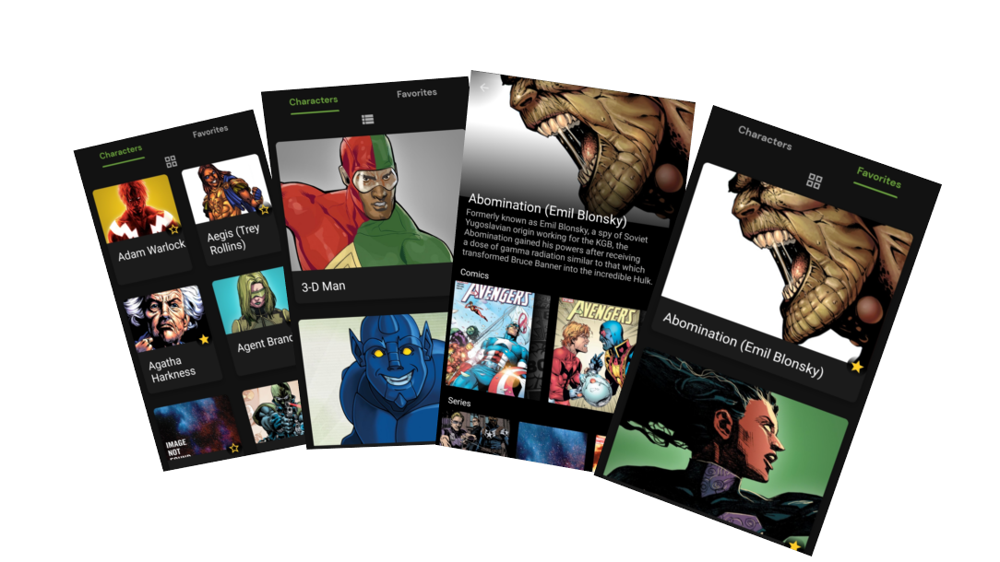

# MarvelComics

## About this Project

We mobile are Marvel fans 😍, so that's why we'd like an app to list the characters and learn more about them 🚀.

This app shows a list of Marvel characters, clicking on them you navigate to each character's details 👾. It is also possible to mark the character in the list. Favorite characters are kept on the device so they can be accessed offline and are shown in their own tab.

## API Marvel

This app consumes a REST API, for more information visit the link: https://developer.marvel.com/docs

## Specifications and Technologies

- 100% Kotlin 
- Architecture MVVM
- Clean Architecture
- Design Patterns
- Data Binding
- Android Jetpack 
  * Navigation
  * Live Data
  * Room
- Data base SQlite
- Kotlin Coroutines
- Retrofit 2  
  * Interceptor OkHttp3
  * Converter Moshi
- Depedence Injection :syringe: Dagger 2

## Collaborate too

This project is part of my personal portfolio, so, I'll be happy if you could provide me any feedback about the project,
code, structure or anything that you can report that could make me a better developer!

Email-me: rafaelcapgomes@gmail.com

Connect with me at [LinkedIn](https://www.linkedin.com/in/rafael-araujo-206819181).

Also, you can use this Project as you wish, be for study, be for make improvements or earn money with it!

It's free!

## Installers

If you want to test the App in the Production mode, the installers are listed below:

[Android.apk installer](https://drive.google.com/file/d/1f3NCCmDttxtAFBaEHYXrWkWbPTJvxAJ2/view?usp=sharing)

## Built With

- [Android-Studio](https://developer.android.com/studio/preview?hl=pt) - Official native android development IDE

## License

This project is licensed under the MIT License - see the [LICENSE.md](https://github.com/steniowagner/mindCast/blob/master/LICENSE) file for details

 

 
